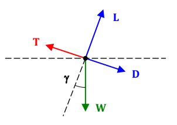

Climb performance
=================

From the general equations of motion introduced in previous sections and
assuming steady conditions, it is possible to find the following relationship
for an airplane performing a climbing maneuver:

.. math::

    \begin{align}
        T &= D + W\sin{(\gamma)}\\
        L &= W \cos{(\gamma)}\\
    \end{align}

We are interested in the climbing angle, denoted in previous equations by the
gamma letter. From the first equation, it is possible to obtain:

.. math::
    
    \sin{(\gamma)} = \frac{T-D}{W}=\frac{T}{W}-\frac{D}{L / \cos \gamma} \approx \frac{T}{W}-\frac{1}{L / D}

If we are interested in the rate of climb of the aircraft, usually refered as
ROT, we can solve for the vertical component by multiplying the previously found
sine of the climbing angle times the actual TAS velocity of the aircraft; then:

.. math::

    ROC = V_{V} = V \sin{(\gamma)} = V \frac{T-D}{W}=\frac{T}{W}-\frac{D}{L / \cos \gamma}

Optimal climbing rate
---------------------

Following question might if there exists a climbing angle such it maximizes the
rate of climb. We might be facing two kinds of aircraft: propeller and jet ones.

Best ROC propeller aircraft
^^^^^^^^^^^^^^^^^^^^^^^^^^^

It is to rewrite the vertical speed of the aircraft as:

.. math::

    V_{V} = \frac{\eta_{P} P_{p}}{W} - \frac{V}{L/D}

For this kind of aircraft, power can be assumed to be independent of speed for
simplifications.  Furthermore, considering a constant weight, the fractional
term becomes constant and we only need to minimize the second one in order to
find the maximum ROC.  This condition is achieved at the speed of minimum power,
which can be expressed in terms of the minimum thrust one:

.. math::

    \begin{align}
        C_{LminP} &= \sqrt{3} C_{LminT}\\
        C_{DminP} &= 4.0 \cdot C_{D0}\\
        E_{minP}  &= \frac{\sqrt{3}}{4} E_{minT}\\
        V_{minP}  &= V_{broc} = \frac{1}{\sqrt{\sqrt{3}}} V_{minT}\\
    \end{align}

By substituting the previously found minimum power speed it is possible to find
the best ROC for propeller aircraft.

Best ROC jet aircraft
^^^^^^^^^^^^^^^^^^^^^

In jet aircraft, thrust is independent of speed. By substuting the polar drag
and solving for the speed that maximizes the vertical one, the following
expression arises:

.. math:: 

    V_{V}=V\left(\frac{T}{W}-\frac{D}{L}\right)=V\left(\frac{T}{W}-\frac{C_{D 0}}{C_{L}}-K C_{L}\right)=V \frac{T}{W}-\frac{\rho V^{3} C_{D 0}}{2 W / S}-\frac{2 K}{\rho V} \frac{W}{S}

Therefore:

.. math::

    \begin{aligned}
        \frac{\partial V_{V}}{\partial V} &= \frac{T}{W}-\frac{3 \rho V^{2} C_{D 0}}{2 W / S}+\frac{2 K}{\rho V^{2}} \frac{W}{S} = 0\\ 
        V_{\text {broc}} &=\sqrt{\frac{W / S}{3 \rho C_{D 0}}\left(\frac{T}{W}+\sqrt{\left(\frac{T}{W}\right)^{2}+12 C_{D 0} K}\right)}
    \end{aligned}

Fuel consumption during climbing
--------------------------------

We have assumed that lift is equal to the weight since the cosine of the
climbing angle might be approximated to unity. Furthermore, another
simplification which has been done is the assumption of steady conditions, which
neglects the acceleration terms due to height variation.

Though the procedure will not be shown in this lines, it is possible to obtain
as for level flight the so-called "generalized Breguet equation", which solves
not only for the range in climbing conditions but also for the range in
non-uniform speed in cruise flight:

.. math::

        R=\frac{V}{C} \frac{L}{D} \ln \left(\frac{W_{1}}{W_{2}}\right)-\frac{L}{D}\left(h_{2}-h_{1}+\frac{V_{2}^{2}-V_{1}^{2}}{2 g}\right)

Notice that in previous equation and while in level flight, both final and
initial conditions for altitude and speed are zero, making the most right hand
side fraction to be zero and recovering the previously shown "Breguet range
equation" for straight flight.

